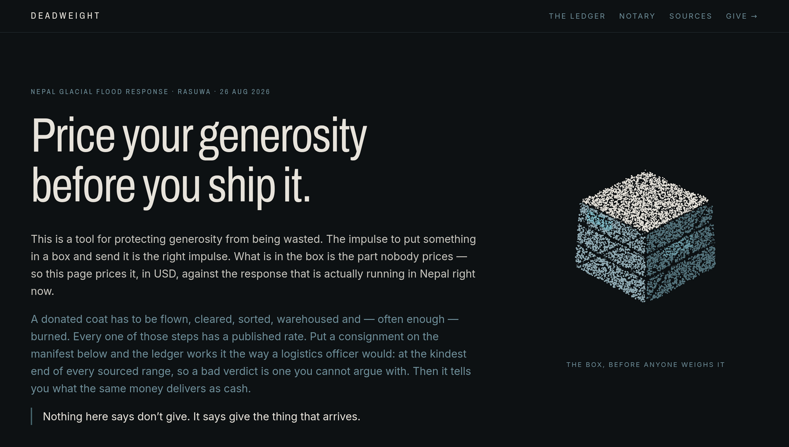
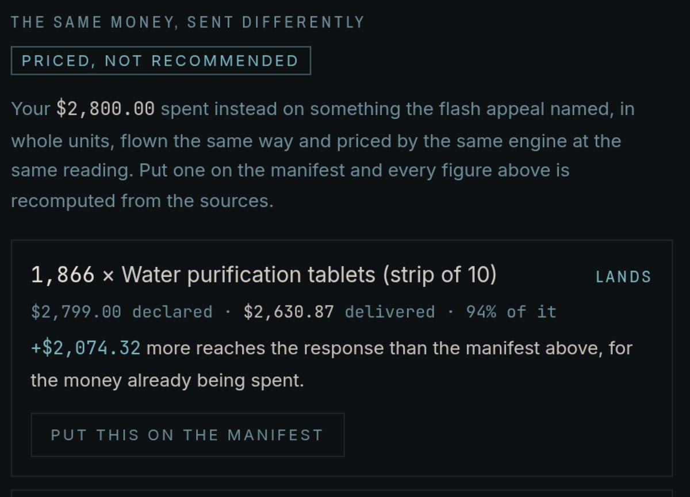
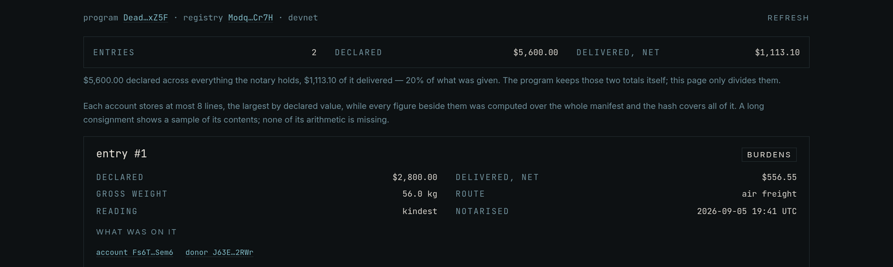
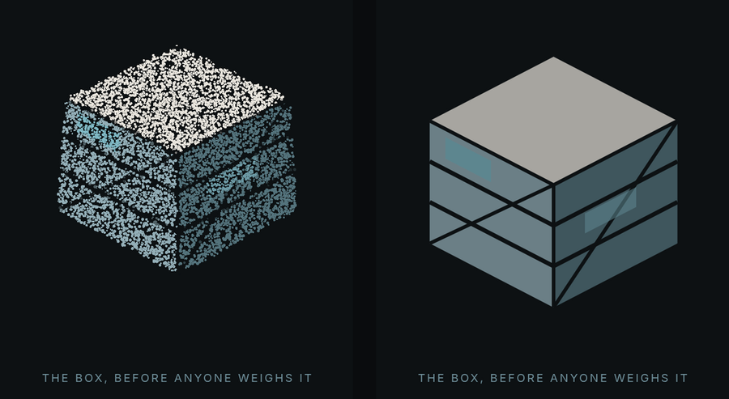

# Deadweight

**Price your generosity before you ship it.**

Someone in the affected districts of Rasuwa needs a coat. You have a coat. The
arithmetic looks finished, and it is not: between your hands and theirs sit an
air waybill, a customs broker, a sorting line paid by the hour, a warehouse in
a country whose warehouses are already full, and — often enough — an
incinerator. Every one of those steps has a published rate. None of them appear
on the box.

Deadweight is a ledger for that gap. You put a consignment on a manifest; it
prices the whole journey in USD, line by line, at the kindest end of every
sourced range, and tells you what actually arrives. Then it does the more
useful half: it spends your same declared total on something the response
actually asked for, prices *that* the same way, and shows you the difference.

Nothing here says don't give. It says give the thing that arrives.

Built for the **DEV Weekend Challenge: Generosity Edition** (`#weekendchallenge`),
set against the response to the glacier-linked debris flow that came down the
Bhotekoshi and Trishuli on **26 August 2026**, and the **US$49.6 million flash
appeal** the UN and partners launched for 84,000 people on 4 September 2026.
Cash assistance is first on that appeal's own priority list. That ordering is
the whole argument of this project, and it is not ours — it is the response's.

**Live:** [deadweight.vercel.app](https://deadweight.vercel.app) · **Tag:**
`#weekendchallenge` · **Prize technologies:** Solana, Google AI (Gemini),
ElevenLabs



---

## The rule the codebase is built to enforce

**One deterministic function owns every number, and no model is ever allowed to
produce one.**

`price()` in `src/lib/logistics.ts` is pure: same manifest, same freight mode,
same reading of the sources, same answer, in integer US cents. It is the only
thing in the repository that does arithmetic on money. The browser calls it, the
route handlers call it, and the Anchor program re-derives its verdict from the
same rule before it will record one.

The language model's job is narration, and the guarantee that it stays narration
is structural rather than hopeful:

- The prompt sent to Gemini **contains no digits at all**.
- The model may state a figure only by emitting a `{{token}}` placeholder.
- `normalize()` then discards the **entire draft** if a digit or a quantity word
  appears anywhere outside a placeholder. There is no repair step, because a
  repair step is a negotiation, and the point is that this is not negotiable.
- The same guarantee extends to the audio: ElevenLabs is handed finished prose.
  No figure can reach your ears that the engine did not compute.

If the model is unavailable, or says something numeric, the letter you read is
the engine's own prose. The feature degrades to the truth rather than to a
placeholder.

---

## What it actually does

**The manifest.** Pick items from a catalogue of the things people really send —
used winter jackets out of a wardrobe, bottled water by the litre, used shoes,
soft toys, assorted medicines from a home cabinet — alongside the things the
appeal actually named, and set quantities. Choose the route: air (days, and the
only way into the cut-off districts), road over the Birgunj–Raxaul crossing
(weeks), or sea and road (months — Nepal is landlocked and the ocean stops at
Kolkata). Then choose how to read the sources: kindest, midpoint, or harshest.

**The ledger.** Every line opens. Freight, handling, customs brokerage, inland
transport, sorting labour, storage in a congested pipeline, disposal of what
cannot be used — each with the rate it used, the range that rate came from, the
publisher, the date, and the multiplication. Where a publisher blocked automated
retrieval, the row says so instead of guessing.


*The box in the garage, sent by air: fifteen used winter jackets, twenty-five
pairs of used shoes, sixty soft toys. $2,800.00 declared. $556.55 arrives. Every
subtraction expands into its rate, its range, its publisher and its date.*

**The verdict.** `LANDS`, `BURDENS`, or `BECOMES ASH`, from the ratio of what
arrives to what you declared. Two items on the catalogue are prohibited outright —
donated infant formula, and part-used or short-dated medicines out of a home
cabinet — and they do not get a gentler verdict for being well meant. Each says
why, in the words of the agencies that ask people not to send them.

**Send this instead.** The constructive half. It takes your declared total,
spends it on something the appeal named, and runs *that* through the same
engine at the same freight mode and the same bias. Nothing new is priced and no
new conversion table is introduced — the comparison is the engine disagreeing
with itself about two ways to spend one sum of money, which is a claim you can
check line by line on both sides. When nothing beats what you have already put
on the manifest, the panel says so and offers nothing.



*The same $2,800.00, spent on something the appeal asked for and priced by the
same engine at the same freight mode and the same bias.*

**The letter.** A short narration of your own ledger, written by Gemini under
the constraint above, speakable by ElevenLabs, and sealed so the audio endpoint
cannot be turned into somebody else's text-to-speech proxy.

**The notary.** Optional, devnet, and labelled as a demonstration everywhere it
appears — see below.

---

## Running it

```bash
npm install
npm run dev          # http://localhost:3000
```

**No environment variable is required.** Every key is optional and every feature
that wants one degrades honestly without it: with no `GEMINI_API_KEY` the letter
is the engine's own prose, with no `ELEVENLABS_API_KEY` the narration falls back
to the browser's own speech synthesis, with no `LETTER_SECRET` the seal uses a
per-process random key. Copy `.env.example` to `.env.local` if you have keys.
Every key is read in a route handler and **none is ever sent to the browser**.

```bash
npm run typecheck    # tsc --noEmit, strict
npm run lint         # eslint src
npm test             # vitest
npm run build
```

Built and verified on Node v24.20.0 with Next.js 16.3.4 (App Router, Turbopack),
React 19, Tailwind v4 and TypeScript in strict mode.

**Tests: 206.** 194 TypeScript tests across 8 files, and 12 Rust tests against
the Anchor program under LiteSVM. Most of them exist to hold the engine still:
the pricing rule, the branded-cents arithmetic, the prohibited-item paths, the
`normalize()` refusal, the HMAC seal, and the "send this instead" ranking.

---

## Where the numbers come from

Twenty-five sources, each cited in the UI with its own date and a link that opens
off-site: the UN's Nepal flash appeal, the World Bank on air freight, the IRC on
the 2026 freight spike and on cost-efficiency, Airlink, OCHA and the Logistics
Cluster on unsolicited goods, IFRC Disaster Law's Vanuatu review, USAID's CIDI
calculator, the US State Department's "Cash is Best", CALP, DFID, ALNAP, UNHCR,
UNICEF and CDC on infant formula, WRAP and NIST on textile reuse, and Nepal's
2025 minimum wage. The ledger footnotes itself; nothing in the prose on the page
is a number typed by hand.

Every citation also records **how honestly we came by it** — `primary` (the
document was fetched and read), `secondary` (a named third party reports the
figure), or `snippet` (the host refused automated retrieval, so the quote comes
from a search index and has not been read in context). The UI surfaces that
grading, and `snippet` is treated as the weakest form of evidence there is.

The rate table holds **14 cells**. Each one is a range, not a point, with a
publisher, a date and a confidence. The default reading is the kindest one — every
cost at the low end of its range, every usefulness at the high end, storage at
zero — so a bad verdict is one you cannot argue your way out of. Midpoint takes
the middle of every range. Harshest costs high, usefulness low, and leaves the
consignment uncollected for the twelve months it sat uncollected in Vanuatu.

**Four of the fourteen are assumptions, and the code says so in the same words:**

| Cell | Range | Source | Dated | Confidence |
| --- | --- | --- | --- | --- |
| `SORTING_HOURS_PER_TONNE` | 8–40 hours/tonne | Logistics Cluster, unsolicited donations | 2021 | low |
| `DISPOSAL_PER_KG` | $0.096–0.30 /kg | NH DES, textile disposal | 2020-01 | low |
| `CONGESTED_STORAGE_MONTHS` | 0–12 months | IFRC Disaster Law, Vanuatu review | 2020 | low |
| `USABLE_REQUESTED` | 0.85–0.95 usable fraction | UN Nepal flash appeal | 2026-09-04 | low |

`assumptionCells()` returns exactly that list, the UI reads it from there, and
the ledger marks the affected rows. A project that prices other people's
generosity does not get to hide its own soft spots.

---

## What is deliberately missing

**The death and missing toll.** Within days of the event, published figures ran
160 → 359 → 538 → 579 → over 1,250, with thousands missing, depending on the
source and the hour. A number that moves like that gets fetched live with its
timestamp and its attribution, or it does not get shown. The live route would
have been the ReliefWeb API, which since **1 November 2025** requires a
pre-approved `appname` and returns `403 AccessDeniedHttpException` to everything
else — verified during this build. So the fetch is not in the shipped app, and
neither is the number. Hardcoding it would have been the exact failure this
project is about.

**Dollars converted into blankets in the region.** The comparison never claims
"$X buys N blankets in Kathmandu". Both sides of it are priced at the same
donor-country retail figures the catalogue already quotes, so the two ledgers
rest on the same kind of number. The reasoning is written out above
`APPEAL_USD_PER_PERSON` in `src/data/rates.ts`.

**Any way to give Deadweight money.** There is no payment path in the codebase.
Every giving link leaves the site for the flash appeal, Nepal Red Cross, Direct
Relief or UNICEF.

---

## The notary — Solana devnet, as a demonstration

An Anchor program with two instructions and no third one. `initialize_registry`
opens a single PDA that keeps running totals. `commit_pledge` records one
decision: the manifest's hash, its declared total, its delivered net, and the
verdict — and it **re-derives that verdict on-chain from the same rule the
engine uses** and rejects the write if the two disagree. There is no `withdraw`
instruction, no treasury, and no lamport path out of the program, because the
app takes no donations and the chain should make that structural rather than
promised.

**It is live on devnet, and every account below is real:**

| | Address |
| --- | --- |
| Program | [`DeadwBH8o2uqPTpdA5LDHmz6i7dv8LGtFFtmytKyxZ5F`](https://explorer.solana.com/address/DeadwBH8o2uqPTpdA5LDHmz6i7dv8LGtFFtmytKyxZ5F?cluster=devnet) |
| ProgramData | [`DnBQn1c849hgekcH9CoWzCuoNYgfv6k1DtgEQnEDf5VF`](https://explorer.solana.com/address/DnBQn1c849hgekcH9CoWzCuoNYgfv6k1DtgEQnEDf5VF?cluster=devnet) |
| IDL metadata | [`FzwrD5Y7tvKj26xNDyQm4ohh3ZWWw5YTQMM7WRVBsfWh`](https://explorer.solana.com/address/FzwrD5Y7tvKj26xNDyQm4ohh3ZWWw5YTQMM7WRVBsfWh?cluster=devnet) |
| Registry PDA | [`ModqnUh86aLw2rBjuhAvm75RBL1pHEePopQHuWoCr7H`](https://explorer.solana.com/address/ModqnUh86aLw2rBjuhAvm75RBL1pHEePopQHuWoCr7H?cluster=devnet) |
| Pledge #0 | [`CDqfAUTtUq7oQhjca84GUskpA6CuZyvy88FUbji7mBYN`](https://explorer.solana.com/address/CDqfAUTtUq7oQhjca84GUskpA6CuZyvy88FUbji7mBYN?cluster=devnet) |
| Pledge #1 | [`Fs6TUfK6Mbviyo7xrsx7PFximYMdkVxqeUA4P6ZeSem6`](https://explorer.solana.com/address/Fs6TUfK6Mbviyo7xrsx7PFximYMdkVxqeUA4P6ZeSem6?cluster=devnet) |

The IDL is uploaded to the chain as well as committed here, so an explorer can
decode those accounts without being handed a schema.



*The panel does its own division on what it read off the chain: two entries,
$5,600.00 declared across both, $1,113.10 of it delivered — 20%.*

Both entries hold the same figures because they are two different manifests that
happen to price identically; **#1 is the app's own default preset**, so its hash
is the one you can reproduce by loading the page and pricing what is already on
it. #0 is not, and it stays there — the program has no close instruction and no
way to revise a record, which is the entire point and also means my own first
entry is permanent. Neither figure was typed by hand: both came out of `price()`
and `pledgeArgsFor()` directly, and the program accepted them only because its
own re-derivation agreed.

Devnet only, and labelled as a demonstration wherever it appears in the UI. What
it is for is the one thing a public ledger is honestly good at here: a
donation decision that cannot be quietly revised afterwards. `public-ledger.tsx`
reads the registry with `fetchNullable`, so when the registry does not exist the
panel says exactly that instead of rendering an empty table.

**Building it — the `--arch v0` note.** Anchor 1.2.0 defaults to `--arch v3`, and
the SBPFv3 ELF that platform-tools v1.57 produces is rejected by litesvm 0.10's
loader with `InvalidAccountData`. So the build is pinned:

```bash
export PATH="$HOME/.local/share/solana/install/active_release/bin:$PATH"
anchor build --arch v0
cargo test --manifest-path programs/deadweight/Cargo.toml   # 12 tests, LiteSVM
```

Verified against Anchor 1.2.0 and Agave 4.2.2. Drop `--arch v0` and the Rust
tests will not run.

---

## It works with the GPU switched off

The header's crate is a particle cloud sampled out of an SVG, and it is the only
WebGL in the app. It is gated three ways: three.js is imported inside an effect
so it never enters the first load, the context is probed before anything mounts,
and `prefers-reduced-motion: reduce` skips it outright. In all three failure
cases the same crate is painted as a still image. Verified headlessly — the
no-WebGL path and the reduced-motion path render byte-identical screenshots — and
checked on Android at **382px** wide, where the headline stays above the fold and
the full-width canvas does not swallow a vertical drag.



*Left: WebGL. Right: the same page under `prefers-reduced-motion: reduce`. The
headline, the figures and every control are identical.*

The crate is decorative and marked `aria-hidden`. It carries no figure. Every
number on the page survives its absence.

---

## Dependencies, and the seven advisories

GitHub reported **seven** advisories against the default branch — 1 critical, 4
high, 2 moderate. Six are gone. The seventh is still there on purpose, and this
section says why, because "we ran `npm audit fix`" is not an answer and neither
is a green badge.

| Advisory | Package | Severity | Now |
| --- | --- | --- | --- |
| [GHSA-5xrq-8626-4rwp](https://github.com/advisories/GHSA-5xrq-8626-4rwp) | `vitest` | critical | fixed — 3.2.4 → **3.2.7** |
| [GHSA-82x6-q7mm-w9cf](https://github.com/advisories/GHSA-82x6-q7mm-w9cf) | `toml` | high | fixed — overridden to **4.3.0** |
| [GHSA-v5mp-jgw5-2x6j](https://github.com/advisories/GHSA-v5mp-jgw5-2x6j) | `toml` | high | fixed — same override |
| [GHSA-w3rx-r6r6-pgpr](https://github.com/advisories/GHSA-w3rx-r6r6-pgpr) | `image-size` | high | **gone** — package no longer installed |
| [GHSA-5p2g-fcmc-qvqq](https://github.com/advisories/GHSA-5p2g-fcmc-qvqq) | `image-size` | high | **gone** — same |
| [GHSA-w5hq-g745-h8pq](https://github.com/advisories/GHSA-w5hq-g745-h8pq) | `uuid` | moderate | fixed — overridden to **11.1.1** |
| [GHSA-528h-pc64-c93x](https://github.com/advisories/GHSA-528h-pc64-c93x) | `stream-json` | moderate | **stays** — unfixable and unreachable |

**The critical one.** `vitest` 3.2.4 can be made to read and execute an arbitrary
file *when its UI server is listening*. This project never runs `--ui`, so it was
never exposed, but a patch bump inside 3.2.x costs nothing and removes the
argument.

**The two `toml` advisories** — uncontrolled recursion, and prototype pollution
reaching `Object.prototype` — come in under `@anchor-lang/core`, which asks for
`^3.0.0` and therefore gets 3.0.0, the vulnerable release. An `overrides` entry
pins 4.3.0. Anchor calls exactly one thing from it, `parse` in `workspace.js`, and
4.3.0 still exports it.

**The `uuid` advisory** (a missing buffer bounds check in v3/v5/v6 when a `buf`
is supplied) comes in under `jayson`, which pins `^8.3.2`. Overridden to 11.1.1;
`jayson` uses `require('uuid').v4` and nothing else. `rpc-websockets` was left on
its own `uuid` 14, which was never affected.

**The two `image-size` advisories had no fix to install.** Both are infinite-loop
denial of service in its ICNS, JXL and HEIF parsers, both are unpatched at the
time of writing — vulnerable at `<=2.0.2`, and 2.0.2 is the latest release — so
no version bump exists. It arrived as a dependency of **metro**, React Native's
bundler, which arrived because `@solana/wallet-adapter-react` depends on
`@solana-mobile/wallet-adapter-mobile`, which declares `react-native: >0.74` as a
**non-optional peer**, and npm 7+ installs non-optional peers automatically.

Nothing in this repository imports React Native. The mobile adapter only requires
it from its `index.native.js` entry points, which metro selects and no web bundler
ever resolves. So the fix was to stop installing a bundler for a platform this app
does not target: `.npmrc` sets `legacy-peer-deps=true`, with that reasoning
written out in the file. **69 packages left the tree** and both advisories left
with them.

The cost of that flag is real and worth stating: npm no longer validates peer
ranges at all. Every peer this project actually needs — `react`, `react-dom`,
`next` — is a direct dependency with an explicit version, and `npm run build` is
the check that they agree. The flag also applies to `npx` invocations run from
this directory, which is how `anchor idl init` came to fail on a missing
`@solana/kit`; that one needs `npm_config_legacy_peer_deps=false` in front of it.

**The one that stays.** `stream-json` 1.9.1, under `jayson`, under
`@solana/web3.js`: its `pick`/`ignore`/`filter`/`replace` filters are O(depth²),
so a small crafted JSON document can block the event loop. It cannot be bumped —
the patched line is 3.5.0+, which is pure ESM with an `exports` map that does not
answer `jayson`'s `require('stream-json/streamers/StreamValues')`, so the fix
breaks the caller. And it cannot be reached from this app: those filters live in
`jayson`'s TCP and TLS transports, and `@solana/web3.js` requires exactly one
`jayson` entry point — `jayson/lib/client/browser` — which pulls in `uuid` and a
request builder and no stream parser at all.

So it is documented rather than dismissed. `npm audit` now ends on `2 moderate
severity vulnerabilities`, which is that one advisory counted twice — once against
`stream-json` and once against `jayson` for depending on it — and nothing else.
The lockfile carries 979 packages. Everything above was re-verified afterwards:
`tsc --noEmit`, `eslint src`, the 194 TypeScript tests, `next build`, and both
pages loaded in headless Chrome with no console error and no uncaught exception.
The wallet modal still mounts.

It also says `fix available via npm audit fix`, which is misleading here: `jayson`
depends on `stream-json: ^1.9.1`, so a plain `npm audit fix` cannot reach 3.x and
changes nothing at all. Only `npm audit fix --force` crosses that major, and it
crosses it into a caller that then cannot `require` its own parser. That is the
one instruction in this section not to follow.

---

## Credits

**[canvas-ui](https://github.com/DavidHDev/canvas-ui) — © 2026 David Haz, MIT +
Commons Clause.** `ParticleObject` is used here, driven through its imperative
API. The copyright notice is retained in the component file, the credit is in the
site footer as well as here, and the components are not redistributed as a
library from this repository.

Rates, ranges and humanitarian figures belong to their publishers and are cited
in the UI with dates and links: UN OCHA, IFRC, the Logistics Cluster, USAID,
the US State Department, the IRC, Airlink, CALP, DFID, ALNAP, UNHCR, UNICEF, CDC,
WRAP, NIST, the World Bank and the others listed in `src/data/citations.ts`.

Gemini writes the letter. ElevenLabs reads it. Neither is allowed to produce a
number.

---

## Provenance

The whole repository was started and finished inside the challenge window —
first commit `aa8d467`, **2026-09-05 13:31 UTC**. Nothing in it predates the
challenge.

## Post-submission changes

*None.* Anything committed after the submission deadline will be listed here,
with what changed and why.


